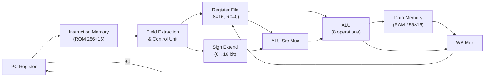

# Milestone 1 — Single-Cycle 16-bit RISC-V-Style CPU

## Architecture Overview

A complete single-cycle processor where all 5 stages (IF → ID → EX → MEM → WB) execute in one clock cycle.



**Memory Model: Harvard Architecture** — Separate instruction ROM and data RAM. This eliminates structural hazards since we simultaneously fetch an instruction and read/write data in a single cycle.

**Word-Addressed Memory** — Each address holds one 16-bit word. PC increments by 1 per cycle. This simplifies address calculation vs byte-addressing while being functionally equivalent for a 16-bit-only data width.

---

## ISA Encoding (Milestone 1)

| Format | Bits 15:12 | Bits 11:9 | Bits 8:6 | Bits 5:3 | Bits 2:0 |
|--------|-----------|-----------|----------|----------|----------|
| **R-Type** | `0000` | rd | rs1 | rs2 | funct |
| **I-Type (LH)** | `0001` | rd | rs1 | imm[5:0] | |
| **S-Type (SH)** | `0010` | rs2 | rs1 | imm[5:0] | |

### R-Type Function Codes

| Instruction | funct | Operation |
|-------------|-------|-----------|
| ADD | `000` | rd = rs1 + rs2 |
| SUB | `001` | rd = rs1 − rs2 |
| SLT | `010` | rd = (rs1 < rs2) ? 1 : 0 (signed) |
| OR | `011` | rd = rs1 \| rs2 |
| AND | `100` | rd = rs1 & rs2 |
| SRL | `101` | rd = rs1 >> rs2[3:0] (logical) |
| SLL | `110` | rd = rs1 << rs2[3:0] |
| SRA | `111` | rd = rs1 >>> rs2[3:0] (arithmetic) |

---

## Module Hierarchy

```
single_cycle_cpu (top)
├── pc_register        — 16-bit program counter
├── instruction_memory — 256×16 ROM (combinational read)
├── register_file      — 8×16 register file (R0 hardwired to 0)
├── sign_extend        — 6-bit to 16-bit sign extension
├── control_unit       — Decodes opcode/funct → control signals
├── alu                — 16-bit ALU (8 operations)
└── data_memory        — 256×16 RAM (combinational read, sync write)
```

## Files Delivered

| File | Purpose |
|------|---------|
| [pc_register.v](file:///c:/Users/PAVITRAM%20KUMAWAT/OneDrive/Desktop/nlp/processor/milestone1/src/pc_register.v) | Program Counter register |
| [instruction_memory.v](file:///c:/Users/PAVITRAM%20KUMAWAT/OneDrive/Desktop/nlp/processor/milestone1/src/instruction_memory.v) | Instruction ROM |
| [register_file.v](file:///c:/Users/PAVITRAM%20KUMAWAT/OneDrive/Desktop/nlp/processor/milestone1/src/register_file.v) | 8×16 Register File |
| [alu.v](file:///c:/Users/PAVITRAM%20KUMAWAT/OneDrive/Desktop/nlp/processor/milestone1/src/alu.v) | 16-bit ALU |
| [data_memory.v](file:///c:/Users/PAVITRAM%20KUMAWAT/OneDrive/Desktop/nlp/processor/milestone1/src/data_memory.v) | Data RAM |
| [sign_extend.v](file:///c:/Users/PAVITRAM%20KUMAWAT/OneDrive/Desktop/nlp/processor/milestone1/src/sign_extend.v) | Sign Extension Unit |
| [control_unit.v](file:///c:/Users/PAVITRAM%20KUMAWAT/OneDrive/Desktop/nlp/processor/milestone1/src/control_unit.v) | Control Unit with full encoding table |
| [single_cycle_cpu.v](file:///c:/Users/PAVITRAM%20KUMAWAT/OneDrive/Desktop/nlp/processor/milestone1/src/single_cycle_cpu.v) | Top-level CPU integration |
| [single_cycle_cpu_tb.v](file:///c:/Users/PAVITRAM%20KUMAWAT/OneDrive/Desktop/nlp/processor/milestone1/tb/single_cycle_cpu_tb.v) | Integration testbench |

---

## Test Program & Results

A 13-instruction test program exercises every Milestone 1 instruction:

| # | Instruction | Expected Result | Status |
|---|------------|-----------------|--------|
| 0 | `LH R1, 0(R0)` | R1 = 5 | ✅ PASS |
| 1 | `LH R2, 1(R0)` | R2 = 3 | ✅ PASS |
| 2 | `ADD R3, R1, R2` | R3 = 8 | ✅ (overwritten by inst 8) |
| 3 | `SUB R4, R1, R2` | R4 = 2 | ✅ (overwritten by inst 9) |
| 4 | `SLT R5, R2, R1` | R5 = 1 (3<5) | ✅ (overwritten by inst 10) |
| 5 | `OR R6, R1, R2` | R6 = 7 | ✅ (overwritten by inst 11) |
| 6 | `AND R7, R1, R2` | R7 = 1 | ✅ (overwritten by inst 12) |
| 7 | `SH R3, 4(R0)` | mem[4] = 8 | ✅ PASS |
| 8 | `SLL R3, R1, R2` | R3 = 40 (5<<3) | ✅ PASS |
| 9 | `SRL R4, R1, R2` | R4 = 0 (5>>3) | ✅ PASS |
| 10 | `LH R5, 2(R0)` | R5 = 0xFFFF | ✅ PASS |
| 11 | `SRA R6, R5, R2` | R6 = 0xFFFF (>>3 arith) | ✅ PASS |
| 12 | `LH R7, 4(R0)` | R7 = 8 (verifies SH) | ✅ PASS |

> [!IMPORTANT]
> **10/10 verification checks PASSED — 0 failures**

## Waveform Checkpoint Guide

To verify in GTKWave, observe these signals:
- `uut.pc` — should increment by 1 each cycle
- `uut.instruction` — verify encoding matches expected
- `uut.u_alu.a`, `uut.u_alu.b` — ALU inputs
- `uut.alu_result` — computation output
- `uut.write_data` — data written back to register file
- `uut.reg_write` — should be HIGH for R-type and LH, LOW for SH
- `uut.mem_read` / `uut.mem_write` — active only for LH/SH respectively

## How to Simulate

```bash
# Compile
C:\iverilog\bin\iverilog.exe -o cpu_tb.vvp src/*.v tb/single_cycle_cpu_tb.v

# Run
C:\iverilog\bin\vvp.exe cpu_tb.vvp

# View waveforms
gtkwave single_cycle_cpu_tb.vcd
```
